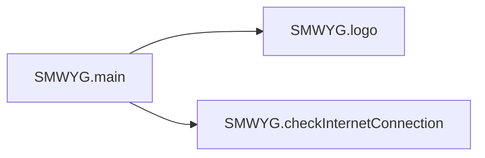

# Key Objects

[_Documentation generated by Documatic_](https://www.documatic.com)

<!---Documatic-section-SMWYG.main-start--->
## SMWYG.main

<!---Documatic-section-main-start--->


### Object Calls

* SMWYG.logo
* SMWYG.checkInternetConnection

<!---Documatic-block-SMWYG.main-start--->
<details>
	<summary><code>SMWYG.main</code> code snippet</summary>

```python
def main():
    print(logo())
    checkInternetConnection()
    try:
        while True:
            choice = input('\n%s' % OPTIONS)
            if choice not in cmds:
                print('[!] Invalid Choice')
                continue
            cmds.get(choice)()
    except KeyboardInterrupt:
        print('[!] Ctrl + C detected\n[!] Exiting')
        sys.exit(0)
    except EOFError:
        print('[!] Ctrl + D detected\n[!] Exiting')
        sys.exit(0)
```
</details>
<!---Documatic-block-SMWYG.main-end--->
<!---Documatic-section-main-end--->

# #
<!---Documatic-section-SMWYG.main-end--->

<!---Documatic-section-SMWYG.checkInternetConnection-start--->
## SMWYG.checkInternetConnection

<!---Documatic-section-checkInternetConnection-start--->
<!---Documatic-block-SMWYG.checkInternetConnection-start--->
<details>
	<summary><code>SMWYG.checkInternetConnection</code> code snippet</summary>

```python
def checkInternetConnection():
    try:
        requests.get('https://www.gotcha.pw/')
    except:
        print('[!] No internet connection...Please connect to the Internet')
    else:
        print('[+] Checking Internet connection...')
        print('[+] Connection Successful <3 <3 <3')
```
</details>
<!---Documatic-block-SMWYG.checkInternetConnection-end--->
<!---Documatic-section-checkInternetConnection-end--->

# #
<!---Documatic-section-SMWYG.checkInternetConnection-end--->

<!---Documatic-section-SMWYG.menu-start--->
## SMWYG.menu

<!---Documatic-section-menu-start--->
<!---Documatic-block-SMWYG.menu-start--->
<details>
	<summary><code>SMWYG.menu</code> code snippet</summary>

```python
def menu():
    while True:
        try:
            choice = str(input('\n[?] Do you want to continue? \n> ')).lower()
            if choice[0] == 'y':
                return
            if choice[0] == 'n':
                sys.exit(0)
                break
        except ValueError:
            sys.exit(0)
```
</details>
<!---Documatic-block-SMWYG.menu-end--->
<!---Documatic-section-menu-end--->

# #
<!---Documatic-section-SMWYG.menu-end--->

<!---Documatic-section-SMWYG.cmdEmailSearch-start--->
## SMWYG.cmdEmailSearch

<!---Documatic-section-cmdEmailSearch-start--->
<!---Documatic-block-SMWYG.cmdEmailSearch-start--->
<details>
	<summary><code>SMWYG.cmdEmailSearch</code> code snippet</summary>

```python
def cmdEmailSearch():
    Email = input('Enter Email Address:').lower()
    pwnedEmail = 'https://gotcha.pw/search/' + Email
    r1 = requests.get(pwnedEmail)
    soup = BeautifulSoup(r1.content, 'html.parser')
    div1 = soup.find('div', {'class': 'col-md-6 fullheight bottombar centerbar pt-3 mb-lg-2 pb-lg-2'})
    print(div1.get_text())
```
</details>
<!---Documatic-block-SMWYG.cmdEmailSearch-end--->
<!---Documatic-section-cmdEmailSearch-end--->

# #
<!---Documatic-section-SMWYG.cmdEmailSearch-end--->

<!---Documatic-section-SMWYG.cmdDomainSearch-start--->
## SMWYG.cmdDomainSearch

<!---Documatic-section-cmdDomainSearch-start--->
<!---Documatic-block-SMWYG.cmdDomainSearch-start--->
<details>
	<summary><code>SMWYG.cmdDomainSearch</code> code snippet</summary>

```python
def cmdDomainSearch():
    Domain = input('Enter Domain Name:').lower()
    pwnedDomain = 'https://gotcha.pw/search/' + Domain
    r = requests.get(pwnedDomain)
    soup = BeautifulSoup(r.content, 'html.parser')
    div = soup.find('div', {'class': 'col-md-6 fullheight bottombar centerbar pt-3 mb-lg-2 pb-lg-2'})
    print(div.get_text())
```
</details>
<!---Documatic-block-SMWYG.cmdDomainSearch-end--->
<!---Documatic-section-cmdDomainSearch-end--->

# #
<!---Documatic-section-SMWYG.cmdDomainSearch-end--->

<!---Documatic-section-SMWYG.logo-start--->
## SMWYG.logo

<!---Documatic-section-logo-start--->
<!---Documatic-block-SMWYG.logo-start--->
<details>
	<summary><code>SMWYG.logo</code> code snippet</summary>

```python
def logo():
    logo = '\n        ___          \n    . -^   `--,      \n   /# =========`-_   \n  /# (--====___====\\ \n /#   .- --.  . --.| \n/##   |  * ) (   * ),\t\t+-+-+-+-+-+-+-+-+-+-+-+-+-+-+-+-+\n|##   \\    /\\ \\   / |\t\t|S|h|o|w|M|e|W|h|a|t|Y|o|u|G|o|t|\n|###   ---   \\ ---  |\t\t+-+-+-+-+-+-+-+-+-+-+-+-+-+-+-+-+\n|####      ___)    #|\t\t\tAuthor: Viral Maniar\n|######           ##|\t\t\tTwitter: @ManiarViral\n \\##### ---------- / \t\t\tDescription: This tool allows you to perform OSINT and reconnaissance on an organization or an individual. It allows one to search 1.4 Billion \n  \\####           (  \t\t\t\tclear text credentials which was dumped as part of BreachCompilation leak. \t\t\n   `\\###          |  \t\t\t\t\t\t\n     \\###         |  \n      \\##        |   \n       \\###.    .)   \n        `======/     \n\t ***1.4 Billion Clear Text Credentials***\n '
    return logo
```
</details>
<!---Documatic-block-SMWYG.logo-end--->
<!---Documatic-section-logo-end--->

# #
<!---Documatic-section-SMWYG.logo-end--->

[_Documentation generated by Documatic_](https://www.documatic.com)